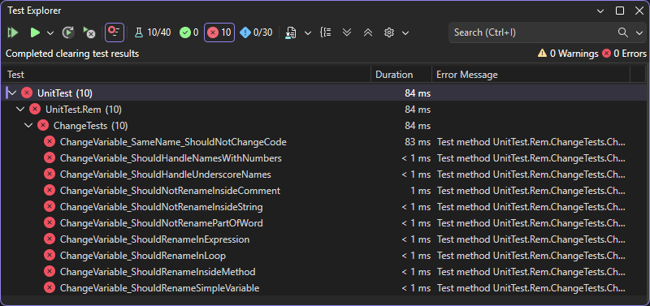
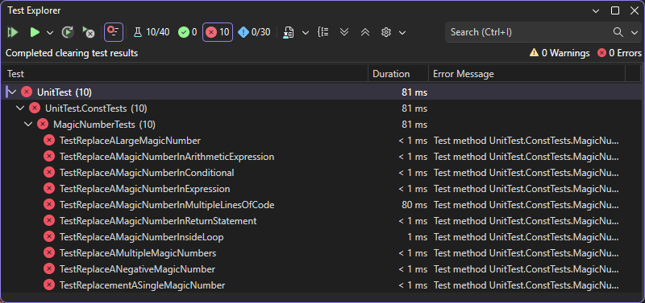
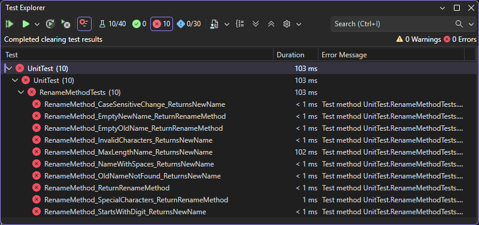
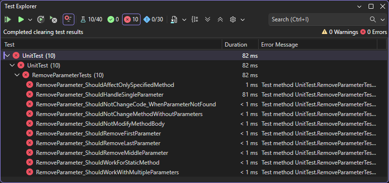

# Лабараторна робота №1

## ПОСТАНОВКА ЗАДАЧІ
> Короткий опис загального завдання та обраних варіантів з поясненням суті кожного методу рефакторингу.

Розробити текстовий редактор на мові програмування C# для виконання рефакторингу вихідних текстів програм мовою С++. Робота виконується проєктними командами по 3-4 особи. Кожен учасник команди обирає один варіант завдання з наведеного переліку. Варіанти всередині команди не повинні повторюватися. 
Команда має:
- дослідити обрані методи рефакторингу: зрозуміти їх суть, вхідні та вихідні умови, правила застосування;
- ознайомитися з принципами TDD та технологією написання модульних (unit) тестів;
- спроєктувати загальну архітектуру програми у вигляді UML-діаграми класів, яка відображає компоненти системи та їх взаємозв’язки;
- створити прототипи класів з оголошеннями методів (без реалізації);
- написати модульні тести, що описують очікувану поведінку кожного методу рефакторингу (по 10 тестів на варіант). 

У результаті має бути отриманий прототип програми без реалізації логіки методів рефакторингу та набір тестів, які не проходять (усі тести “червоні”), що відповідає першому кроку підходу TDD – Red.

### Вибрані варіанти

#### 1. Перейменування змінної — Соломоненко А. А.
Рефакторинг «Перейменування змінної» застосовується у випадках, коли ім’я змінної не відображає її призначення або є недостатньо зрозумілим. Метою цього методу є покращення читабельності та зрозумілості коду шляхом заміни існуючого імені змінної на більш інформативне. Під час виконання рефакторингу нове ім’я повинно бути замінене в усіх місцях використання змінної без зміни логіки роботи програми.

#### 2. Заміна магічного числа символічною константою — Овчаренко Д. К.
Магічні числа – це числові значення, що використовуються в програмному коді без пояснення їх призначення. Використання таких значень ускладнює розуміння програми та її подальшу модифікацію. Рефакторинг «Заміна магічного числа символічною константою» полягає у створенні іменованої константи, яка відображає зміст відповідного числового значення. Після цього всі входження магічного числа у коді замінюються на створену константу. Такий підхід підвищує зрозумілість коду та полегшує його подальшу підтримку.

#### 8. Перейменування методу — Шайкова П. Д.
Рефакторинг «Перейменування методу» використовується у випадках, коли назва методу не відповідає його фактичному призначенню або втратила актуальність у процесі розвитку програмного коду. Метою цього методу є надання методу більш зрозумілого та змістовного імені, що відображає виконувану ним функцію. Під час рефакторингу необхідно змінити назву методу та всі його виклики у програмі без зміни функціональної поведінки системи.

#### 10. Видалення параметра — Солод І. М.
Рефакторинг «Видалення параметра» застосовується у випадках, коли параметр методу не використовується в його реалізації або є зайвим. Наявність зайвих параметрів ускладнює інтерфейс методу та змушує розробників передавати непотрібні дані під час його виклику. Видалення таких параметрів спрощує структуру методу, підвищує зрозумілість коду та зменшує ймовірність помилок під час використання методу.


## КОНЦЕПТУАЛЬНА МОДЕЛЬ СИСТЕМИ
> UML-діаграма класів із поясненнями структури та призначення компонентів.

Посилання для редагування діаграми (https://drive.google.com/file/d/1V6EcfGJ3mPW3xGk00QZrEFD3uISlAHzd/view?usp=sharing)


## ПРОТОТИПИ КЛАСІВ
> Вихідний код оголошень класів і методів (без реалізації).
### Перейменування змінної — Соломоненко А. А.

```cs
using System;
using System.Collections.Generic;
using System.Linq;
using System.Text;
using System.Threading.Tasks;

namespace RefactoringChange
{
    public class RefactorRenamingChangeController
    {
        public string RenameVariable(string sourceCode, string oldName, string newName)
        {
            throw new NotImplementedException();
        }
    }
}
```

### Заміна магічного числа символічною константою — Овчаренко Д. К.

```cs
using System;
using System.Collections.Generic;
using System.Linq;
using System.Text;
using System.Threading.Tasks;

namespace RefactoringTool
{
    public class MagicNumberRefactoring
    {
        public string ReplaceMagicNumber(string sourceCode, string nameOfConstant, string number)
        {
            throw new NotImplementedException();
        }
    }
}
```

### Перейменування методу — Шайкова П. Д.

```cs
using System;
using System.Collections.Generic;
using System.Linq;
using System.Text;
using System.Threading.Tasks;

namespace WindowsFormsApp6
{
    public class RefactorRenameMethodController
    {
        public string RenameMethod(string nameMethod, string newNameMethod, string _empty)
        {
            throw new NotImplementedException();
        }
    }
}
```

### Видалення параметра — Солод І. М.

```cs
using System;
using System.Collections.Generic;
using System.Linq;
using System.Text;
using System.Threading.Tasks;

namespace RefactorApp
{
    public class RefactorRemoveParameterController
    {
        public string RemoveParameter(string CodeText, string methodName, string parameter)
        {
            return "";
        }
    }
}

```

## МОДУЛЬНІ ТЕСТИ
> Вихідний код тестів з XML коментарями, що пояснюють, яку саме поведінку перевіряє кожен тест. Вказати розробника в звіті.

### Перейменування змінної — Соломоненко А. А.

```cs
using Microsoft.VisualStudio.TestTools.UnitTesting;
using RefactoringChange;
using System;
using System.Collections.Generic;
using System.Linq;
using System.Text;
using System.Threading.Tasks;

namespace UnitTest.Rem
{
	[TestClass]
	public class ChangeTests
	{
		/// <summary>
		/// Змінна для зберігання екземпляра ChangeRefactor.
		/// </summary>
		private RefactorChangeController changeRefactor;

		[TestInitialize]
		public void Setup()
		{
			changeRefactor = new RefactorChangeController();
		}

		/// <summary>
		/// Перевіряє просте перейменування змінної.
		/// </summary>
		[TestMethod]
		public void ChangeVariable_ShouldRenameSimpleVariable()
		{
			string code = "int a = 5;";

			string result = changeRefactor.RenameVariable(code, "a", "b");

			Assert.AreEqual("int b = 5;", result);
		}

		/// <summary>
		/// Перевіряє перейменування змінної у виразі.
		/// </summary>
		[TestMethod]
		public void ChangeVariable_ShouldRenameInExpression()
		{
			string code = "int a = 5; int c = a + 2;";

			string result = changeRefactor.RenameVariable(code, "a", "b");

			Assert.AreEqual("int b = 5; int c = b + 2;", result);
		}

		/// <summary>
		/// Перевіряє, що частини інших слів не змінюються.
		/// </summary>
		[TestMethod]
		public void ChangeVariable_ShouldNotRenamePartOfWord()
		{
			string code = "int cat = 5;";

			string result = changeRefactor.RenameVariable(code, "a", "b");

			Assert.AreEqual("int cat = 5;", result);
		}

		/// <summary>
		/// Перевіряє перейменування у циклі.
		/// </summary>
		[TestMethod]
		public void ChangeVariable_ShouldRenameInLoop()
		{
			string code = "for(int a = 0; a < 10; a++) { }";

			string result = changeRefactor.RenameVariable(code, "a", "b");

			Assert.AreEqual("for(int b = 0; b < 10; b++) { }", result);
		}

		/// <summary>
		/// Перевіряє перейменування у межах методу.
		/// </summary>
		[TestMethod]
		public void ChangeVariable_ShouldRenameInsideMethod()
		{
			string code = "void Test() { int a = 1; }";

			string result = changeRefactor.RenameVariable(code, "a", "b");

			Assert.AreEqual("void Test() { int b = 1; }", result);
		}

		/// <summary>
		/// Перевіряє, що змінні у рядках не змінюються.
		/// </summary>
		[TestMethod]
		public void ChangeVariable_ShouldNotRenameInsideString()
		{
			string code = "Console.WriteLine(\"a = 5\");";

			string result = changeRefactor.RenameVariable(code, "a", "b");

			Assert.AreEqual("Console.WriteLine(\"a = 5\");", result);
		}

		/// <summary>
		/// Перевіряє, що змінні у коментарях не змінюються.
		/// </summary>
		[TestMethod]
		public void ChangeVariable_ShouldNotRenameInsideComment()
		{
			string code = "int a = 5; // a variable";

			string result = changeRefactor.RenameVariable(code, "a", "b");

			Assert.AreEqual("int b = 5; // a variable", result);
		}

		/// <summary>
		/// Перевіряє, що змінна з підкресленням коректно перейменовується.
		/// </summary>
		[TestMethod]
		public void ChangeVariable_ShouldHandleUnderscoreNames()
		{
			string code = "int my_var = 10; int x = my_var + 1;";

			string result = changeRefactor.RenameVariable(code, "my_var", "new_var");

			Assert.AreEqual("int new_var = 10; int x = new_var + 1;", result);
		}

		/// <summary>
		/// Перевіряє, що змінна не змінюється, якщо нове ім'я таке ж саме.
		/// </summary>
		[TestMethod]
		public void ChangeVariable_SameName_ShouldNotChangeCode()
		{
			string code = "int a = 5;";


			string result = changeRefactor.RenameVariable(code, "a", "a");

			Assert.AreEqual(code, result);
		}

		/// <summary>
		/// Перевіряє, що змінна з цифрами в імені коректно перейменовується.
		/// </summary>
		[TestMethod]
		public void ChangeVariable_ShouldHandleNamesWithNumbers()
		{
			string code = "int a1 = 5; int b = a1 + 2;";

			string result = changeRefactor.RenameVariable(code, "a1", "x1");

			Assert.AreEqual("int x1 = 5; int b = x1 + 2;", result);
		}
	}
}
```

### Заміна магічного числа символічною константою — Овчаренко Д. К.

```cs
using Microsoft.VisualStudio.TestTools.UnitTesting;
using RefactoringTool;
using System;
using System.Collections.Generic;
using System.Linq;
using System.Text;
using System.Threading.Tasks;

namespace UnitTest.ConstTests
{
    [TestClass]
    public class MagicNumberTests
    {
        private MagicNumberRefactoring refactoring = new MagicNumberRefactoring();

        /// <summary>
        /// Verifies replacement of a single magic number with a constant.
        /// </summary>
        [TestMethod]
        public void TestReplacementASingleMagicNumber()
        {
            string input = "int x = 10;";
            string result = refactoring.ReplaceMagicNumber(input, "MAGIC_NUMBER", "10");
            Assert.AreEqual("const int MAGIC_NUMBER = 10;\nint x = MAGIC_NUMBER;", result);
        }

        /// <summary>
        /// Verifies replacement of a magic number inside an expression.
        /// </summary>
        [TestMethod]
        public void TestReplaceAMagicNumberInExpression()
        {
            string input = "int y = a + 5;";
            string result = refactoring.ReplaceMagicNumber(input, "MAGIC_NUMBER", "5");
            Assert.AreEqual("const int MAGIC_NUMBER = 5;\nint y = a + MAGIC_NUMBER;", result);
        }

        /// <summary>
        /// Verifies replacement of a magic number in a conditional statement.
        /// </summary>
        [TestMethod]
        public void TestReplaceAMagicNumberInConditional()
        {
            string input = "if (x > 100)";
            string result = refactoring.ReplaceMagicNumber(input, "MAGIC_NUMBER", "100");
            Assert.AreEqual("const int MAGIC_NUMBER = 100;\nif (x > MAGIC_NUMBER)", result);
        }

        /// <summary>
        /// Verifies replacement of a magic number inside a loop.
        /// </summary>
        [TestMethod]
        public void TestReplaceAMagicNumberInsideLoop()
        {
            string input = "for(int i=0;i<10;i++)";
            string result = refactoring.ReplaceMagicNumber(input, "MAGIC_NUMBER", "10");
            Assert.AreEqual("const int MAGIC_NUMBER = 10;\nfor(int i=0;i<MAGIC_NUMBER;i++)", result);
        }

        /// <summary>
        /// Verifies replacement of multiple identical magic numbers.
        /// </summary>
        [TestMethod]
        public void TestReplaceAMultipleMagicNumbers()
        {
            string input = "int a = 5; int b = 5;";
            string result = refactoring.ReplaceMagicNumber(input, "MAGIC_NUMBER", "5");
            Assert.AreEqual("const int MAGIC_NUMBER = 5;\nint a = MAGIC_NUMBER; int b = MAGIC_NUMBER;", result);
        }

        /// <summary>
        /// Verifies replacement of a magic number in an arithmetic expression.
        /// </summary>
        [TestMethod]
        public void TestReplaceAMagicNumberInArithmeticExpression()
        {
            string input = "int z = 3 * value;";
            string result = refactoring.ReplaceMagicNumber(input, "MAGIC_NUMBER", "3");
            Assert.AreEqual("const int MAGIC_NUMBER = 3;\nint z = MAGIC_NUMBER * value;", result);
        }

        /// <summary>
        /// Verifies replacement of a large magic number.
        /// </summary>
        [TestMethod]
        public void TestReplaceALargeMagicNumber()
        {
            string input = "int max = 1000;";
            string result = refactoring.ReplaceMagicNumber(input, "MAGIC_NUMBER", "1000");
            Assert.AreEqual("const int MAGIC_NUMBER = 1000;\nint max = MAGIC_NUMBER;", result);
        }

        /// <summary>
        /// Verifies replacement of a negative magic number.
        /// </summary>
        [TestMethod]
        public void TestReplaceANegativeMagicNumber()
        {
            string input = "int x = -5;";
            string result = refactoring.ReplaceMagicNumber(input, "MAGIC_NUMBER", "-5");
            Assert.AreEqual("const int MAGIC_NUMBER = -5;\nint x = MAGIC_NUMBER;", result);
        }

        /// <summary>
        /// Verifies replacement of a magic number in a return statement.
        /// </summary>
        [TestMethod]
        public void TestReplaceAMagicNumberInReturnStatement()
        {
            string input = "return 7;";
            string result = refactoring.ReplaceMagicNumber(input, "MAGIC_NUMBER", "7");
            Assert.AreEqual("const int MAGIC_NUMBER = 7;\nreturn MAGIC_NUMBER;", result);
        }

        /// <summary>
        /// Verifies replacement of a magic number appearing in multiple lines of code.
        /// </summary>
        [TestMethod]
        public void TestReplaceAMagicNumberInMultipleLinesOfCode()
        {
            string input = "uint a = 2;\nint b = a * 2;";
            string result = refactoring.ReplaceMagicNumber(input, "MAGIC_NUMBER", "2");
            Assert.AreEqual("const int MAGIC_NUMBER = 2;\nuint a = MAGIC_NUMBER;\nint b = a * MAGIC_NUMBER;", result);
        }
    }
}
```

### Перейменування методу — Шайкова П. Д.

```cs
using Microsoft.VisualStudio.TestTools.UnitTesting;
using RefactoringApp;
using RefactorApp;
using RefactoringTool;
using System;
using System.Collections.Generic;
using System.Linq;
using System.Text;
using System.Threading.Tasks;

namespace UnitTest
{
    [TestClass]
    public class RenameMethodTests
    {
        private RefactorRenameMethodController refactorController = new RefactorRenameMethodController();

        /// <summary>
        /// Коректна робота тесту
        /// </summary>
        [TestMethod]
        public void RenameMethod_ReturnRenameMethod()
        {
            var result = this.refactorController.RenameMethod("OldName", "NewName", null);
            Assert.AreEqual("NewName", result);
        }

        /// <summary>
        /// Відсутня стара назва методу
        /// </summary>
        [TestMethod]
        public void RenameMethod_EmptyOldName_ReturnRenameMethod()
        {
            var result = this.refactorController.RenameMethod("", "NewName", null);
            Assert.AreEqual("Error: empty parameter", result);
        }

        /// <summary>
        /// Відсутня нова назва тесту
        /// </summary>
        [TestMethod]
        public void RenameMethod_EmptyNewName_ReturnRenameMethod()
        {
            var result = this.refactorController.RenameMethod("OldName", "", null);
            Assert.AreEqual("OldName", result);
        }

        /// <summary>
        /// 
        /// </summary>
        [TestMethod]
        public void RenameMethod_SpecialCharacters_ReturnRenameMethod()
        {
            var result = this.refactorController.RenameMethod("Old_Method1", "New_Method2", null);
            Assert.AreEqual("New_Method2", result);
        }

        /// <summary>
        /// Чутливість до регістру
        /// </summary>
        [TestMethod]
        public void RenameMethod_CaseSensitiveChange_ReturnsNewName()
        {
            var result = this.refactorController.RenameMethod("method", "Method", null);
            Assert.AreEqual("Method", result);
        }

        /// <summary>
        /// максимальна довжина назви методу
        /// </summary>
        [TestMethod]
        public void RenameMethod_MaxLengthName_ReturnsNewName()
        {
            var newName = new string('a', 255);

            var result = this.refactorController.RenameMethod("OldName", newName, null);

            Assert.AreEqual(newName, result);
        }

        /// <summary>
        /// Імена з пробілами
        /// </summary>
        [TestMethod]
        public void RenameMethod_NameWithSpaces_ReturnsNewName()
        {
            var result = this.refactorController.RenameMethod("OldName", "New Name", null);
            Assert.AreEqual("Error: spaces", result);
        }

        /// <summary>
        /// Неправильні символи
        /// </summary>
        [TestMethod]
        public void RenameMethod_InvalidCharacters_ReturnsNewName()
        {
            var result = this.refactorController.RenameMethod("OldName", "New@Name", null);
            Assert.AreEqual("Error: invalid characters", result);
        }

        /// <summary>
        /// Старе ім'я не знайдено
        /// </summary>
        [TestMethod]
        public void RenameMethod_OldNameNotFound_ReturnsNewName()
        {
            var result = this.refactorController.RenameMethod("Name", "NewName", null);
            Assert.AreEqual("Error: method name not found", result);
        }

        /// <summary>
        /// Назва починається з цифри
        /// </summary>
        [TestMethod]
        public void RenameMethod_StartsWithDigit_ReturnsNewName()
        {
            var result = this.refactorController.RenameMethod("OldName", "1NewName", null);
            Assert.AreEqual("Error: starts with digit", result);
        }
    }
}
```

###  Видалення параметра — Солод І. М.

```cs
using Microsoft.VisualStudio.TestTools.UnitTesting;
using RefactorApp;

namespace UnitTest
{
    [TestClass]
    public class RemoveParameterTests
    {
        /// <summary>
        /// Змінна для зберігання екземпляра RefactorController, який буде використовуватися у всіх тестах.
        /// </summary>
        private RefactorRemoveParameterController refactorController;

        /// <summary>
        /// Перевіряє, що перший параметр методу коректно видаляється.
        /// </summary>
        [TestMethod]
        public void RemoveParameter_ShouldRemoveFirstParameter()
        {
            string code = "public void Calculate(int a, int b) { }";

            string result = refactorController.RemoveParameter(code, "Calculate", "a");

            Assert.AreEqual("public void Calculate(int b) { }", result);
        }

        /// <summary>
        /// Перевіряє, що останній параметр методу коректно видаляється.
        /// </summary>
        [TestMethod]
        public void RemoveParameter_ShouldRemoveLastParameter()
        {
            string code = "public void PrintData(string name, int age) { }";

            string result = refactorController.RemoveParameter(code, "PrintData", "age");

            Assert.AreEqual("public void PrintData(string name) { }", result);
        }

        /// <summary>
        /// Перевіряє видалення параметра, що знаходиться в середині списку параметрів.
        /// </summary>
        [TestMethod]
        public void RemoveParameter_ShouldRemoveMiddleParameter()
        {
            string code = "public void SendMessage(string from, string text, string to) { }";

            string result = refactorController.RemoveParameter(code, "SendMessage", "text");

            Assert.AreEqual("public void SendMessage(string from, string to) { }", result);
        }

        /// <summary>
        /// Перевіряє видалення єдиного параметра методу. Після рефакторингу метод повинен залишитися без параметрів.
        /// </summary>
        [TestMethod]
        public void RemoveParameter_ShouldHandleSingleParameter()
        {
            string code = "public void Reset(int value) { }";

            string result = refactorController.RemoveParameter(code, "Reset", "value");

            Assert.AreEqual("public void Reset() { }", result);
        }

        /// <summary>
        /// Перевіряє поведінку системи, якщо параметр для видалення не знайдено.
        /// </summary>
        [TestMethod]
        public void RemoveParameter_ShouldNotChangeCode_WhenParameterNotFound()
        {
            string code = "public void StartGame(int level, string mode) { }";

            string result = refactorController.RemoveParameter(code, "StartGame", "score");

            Assert.AreEqual("public void StartGame(int level, string mode) { }", result);
        }

        /// <summary>
        /// Перевіряє, що параметр видаляється лише у зазначеному методі, навіть якщо в коді присутні інші методи.
        /// </summary>
        [TestMethod]
        public void RemoveParameter_ShouldAffectOnlySpecifiedMethod()
        {
            string code = "public void A(int x, int y) { } " + "public void B(int a, int b) { }";

            string result = refactorController.RemoveParameter(code, "A", "x");

            Assert.AreEqual("public void A(int y) { } public void B(int a, int b) { }", result);
        }

        /// <summary>
        /// Перевіряє коректність роботи рефакторингу для статичного методу.
        /// </summary>
        [TestMethod]
        public void RemoveParameter_ShouldWorkForStaticMethod()
        {
            string code = "public static void Log(string message, int level) { }";

            string result = refactorController.RemoveParameter(code, "Log", "level");

            Assert.AreEqual("public static void Log(string message) { }", result);
        }

        /// <summary>
        /// Перевіряє поведінку алгоритму, якщо метод не має параметрів.
        /// </summary>
        [TestMethod]
        public void RemoveParameter_ShouldNotChangeMethodWithoutParameters()
        {
            string code = "public void Start() { }";

            string result = refactorController.RemoveParameter(code, "Start", "x");

            Assert.AreEqual("public void Start() { }", result);
        }

        /// <summary>
        /// Перевіряє видалення параметра у методі з великою кількістю аргументів.
        /// </summary>
        [TestMethod]
        public void RemoveParameter_ShouldWorkWithMultipleParameters()
        {
            string code = "public void Move(int x, int y, int z, int speed) { }";

            string result = refactorController.RemoveParameter(code, "Move", "z");

            Assert.AreEqual("public void Move(int x, int y, int speed) { }", result);
        }

        /// <summary>
        /// Перевіряє, що рефакторинг не змінює тіло методу, а модифікує лише список параметрів.
        /// </summary>
        [TestMethod]
        public void RemoveParameter_ShouldNotModifyMethodBody()
        {
            string code = "public void Add(int a, int b) { int c = a + b; }";

            string result = refactorController.RemoveParameter(code, "Add", "b");

            Assert.AreEqual("public void Add(int a) { int c = a + b; }", result);
        }
    }
}
```


## РЕЗУЛЬТАТИ ЗАПУСКУ ТЕСТІВ
> Скриншот, що підтверджує невдале проходження всіх тестів (“червоний” стан).
### Перейменування змінної — Соломоненко А. А.



### Заміна магічного числа символічною константою — Овчаренко Д. К.



### Перейменування методу — Шайкова П. Д.



### Видалення параметра — Солод І. М.




## ВИСНОВКИ
У ході виконання роботи було проведено дослідження предметної області, пов’язаної з інструментами рефакторингу програмного коду. Проаналізовано основні підходи до перейменування методів та замінної видалення параметра, заміна магічного числа символічної константою.

У процесі проєктування розроблено прототип програмного продукту без реалізації внутрішньої логіки, що відповідає підходу TDD (Test-Driven Development). Було створено набір модульних тестів, які описують функціональні вимоги та очікувані результати роботи системи. Оскільки реалізація методів відсутня, тести на даному етапі не проходять, що є передбачуваним.
